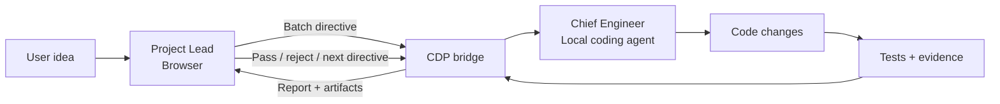

# dual-agent-loop

> Turn two AI agents into a closed-loop software engineering team.

[](./LICENSE)
[](./SKILL.md)
[](https://developer.chrome.com/docs/devtools/)

**`dual-agent-loop`** is an open-source engineering workflow and agent skill that separates software development into two cooperating roles:

- **Project Lead** — runs in a browser-based ChatGPT / Claude session and owns requirements, architecture, review, acceptance gates, and final sign-off.
- **Chief Engineer** — runs in a local coding agent such as Antigravity, Claude Code, Codex, or another CLI agent and owns implementation, tests, repository changes, and evidence collection.

The two roles exchange directives and evidence through **Chrome DevTools Protocol (CDP)**, so the user does not have to manually copy every message between the browser and terminal.

**The goal:** make agentic software development more reviewable, regression-aware, and repeatable — not merely more autonomous.

[Quick start](#quick-start) · [How it works](#how-it-works) · [Engineering gates](#engineering-gates) · [Security](#security) · [中文介绍](#简体中文介绍)

---

## Why this exists

A single coding agent is often asked to do four very different jobs at once: define the product, design the architecture, modify the codebase, and judge whether its own work is good enough.

`dual-agent-loop` deliberately splits those responsibilities.

| Project Lead | Chief Engineer |
| --- | --- |
| Refines ambiguous requirements | Inspects the local repository and environment |
| Chooses architecture and acceptance criteria | Implements the smallest compliant change |
| Issues bounded batch directives | Runs unit / integration / E2E checks |
| Reviews screenshots and evidence | Produces machine-readable reports |
| Freezes accepted UI/contracts | Reports back through CDP |
| Decides whether work passes a gate | Does not self-approve product quality |

This creates an explicit **plan → implement → prove → review → continue** loop.

---

## How it works



The workflow is organized into five lifecycle phases:

1. **Charter & Architecture** — turn a one-line idea into scope, constraints, contracts, and an implementation plan.
2. **Walking Skeleton** — create the smallest runnable system and establish the first automated baseline.
3. **Domain Logic** — implement business rules behind testable boundaries.
4. **Presentation & Integration** — connect APIs/UI/CLI surfaces and collect integration/visual evidence.
5. **Hardening & Release** — run stress/simulation/release checks appropriate to the project before final sign-off.

The lifecycle is designed to adapt across web, backend, CLI, mobile, and game projects. Project-specific tools and gates still need to match the actual stack.

---

## Engineering gates

### 1. Zero-new-regression attribution

Instead of treating every pre-existing test failure as a failure introduced by the current change, the included comparator computes:

```text
HEAD-ONLY failures = failures(HEAD) - failures(baseline)
```

The default gate requires:

```text
HEAD-ONLY failures = 0
```

`scripts/compare_attribution.py` supports NUnit-style XML and common JUnit-style XML outputs. Test runners such as Jest, Vitest, or Pytest can participate when configured to emit a compatible JUnit XML report.

### 2. Frozen contracts and accepted UI

Once the Lead marks an interface, behavior, or visual surface as **FROZEN**, later batches must preserve it unless a new directive explicitly reopens that surface.

### 3. Evidence before completion claims

The Engineer should attach objective evidence whenever practical: tests, logs, diffs, machine-readable reports, or screenshots. `scripts/capture_screen.py` currently validates screenshot dimensions and formats visual evidence; project-specific capture tooling can produce the source screenshots.

### 4. Automation-first verification

If a requirement can reasonably be proven by a repeatable automated check, prefer that check over asking the user to manually click through the same verification every batch.

---

## Quick start

### Prerequisites

- Python 3
- Google Chrome / Chromium with CDP support
- A browser session for ChatGPT or Claude
- A local coding agent capable of running shell commands and editing files

### 1. Install the skill

From your target project directory:

```bash
git clone https://github.com/xulu1998/dual-agent-loop.git .agents/skills/dual-agent-loop
python -m pip install -r .agents/skills/dual-agent-loop/requirements.txt
```

If your agent uses a different skill directory, clone the repository wherever that agent can read `SKILL.md`.

### 2. Launch an isolated Chrome profile with remote debugging

> **Chrome 136+ note:** Chrome no longer honors `--remote-debugging-port` against the default Chrome data directory. Use a separate `--user-data-dir` as shown below. Keeping the automation profile separate from your everyday browser profile is also safer.

**macOS**

```bash
/Applications/Google\ Chrome.app/Contents/MacOS/Google\ Chrome \
  --remote-debugging-port=9222 \
  --user-data-dir="$HOME/.dual-agent-loop/chrome-profile"
```

**Linux**

```bash
google-chrome \
  --remote-debugging-port=9222 \
  --user-data-dir=/tmp/dual-agent-loop-chrome
```

**Windows PowerShell**

```powershell
& "$env:ProgramFiles\Google\Chrome\Application\chrome.exe" `
  --remote-debugging-port=9222 `
  "--user-data-dir=$env:TEMP\dual-agent-loop-chrome"
```

In that isolated Chrome profile, sign in to ChatGPT or Claude and open the conversation that will act as the Project Lead.

### 3. Smoke-test the bridge

For ChatGPT:

```bash
python .agents/skills/dual-agent-loop/scripts/chatgpt_cdp_bridge.py \
  --pattern chatgpt.com \
  --message "Reply with exactly: DUAL_AGENT_LOOP_OK"
```

For Claude, use:

```bash
python .agents/skills/dual-agent-loop/scripts/chatgpt_cdp_bridge.py \
  --pattern claude.ai \
  --message "Reply with exactly: DUAL_AGENT_LOOP_OK"
```

If the terminal receives the browser agent's reply, the transport is working.

### 4. Start the engineering loop

Give your local Engineer agent a prompt like this:

```text
Read .agents/skills/dual-agent-loop/SKILL.md and act as the Chief Engineer.
Use the dual-agent-loop CDP bridge to communicate with the Project Lead
running in Chrome on port 9222.

Project idea:
[describe the product in one or two sentences]

Start at Phase 0. Ask the Project Lead to refine the charter and issue the
first bounded batch directive. After each batch, run the required gates and
send an evidence-backed report to the Lead before continuing.
```

For a more detailed Codex / CLI walkthrough, see **[references/CODEX_GUIDE.md](./references/CODEX_GUIDE.md)**.

---

## Example regression gate

```bash
python .agents/skills/dual-agent-loop/scripts/compare_attribution.py \
  --baseline artifacts/baseline.xml \
  --head artifacts/head.xml \
  --suite "Unit Tests" \
  --json artifacts/attribution.json
```

A passing run reports zero HEAD-only failures. See **[examples/sample_report.md](./examples/sample_report.md)** for an example evidence packet.

---

## Repository layout

```text
dual-agent-loop/
├── SKILL.md                       # Agent workflow contract / skill entry point
├── README.md                      # Project overview and quick start
├── SECURITY.md                    # CDP and authenticated-browser safety guidance
├── requirements.txt               # Lightweight Python dependencies
├── scripts/
│   ├── chatgpt_cdp_bridge.py      # Browser ↔ terminal CDP message bridge
│   ├── compare_attribution.py     # Baseline-vs-HEAD regression attribution gate
│   └── capture_screen.py          # Screenshot evidence inspector / formatter
├── references/
│   ├── LIFECYCLE_STAGES.md        # Five-phase lifecycle details
│   ├── PROJECT_INITIALIZER.md     # Stack-adaptation guidance
│   ├── WORKFLOW_SPEC.md           # Roles, boundaries, and SOP
│   ├── REPORT_TEMPLATES.md        # Completion / blocker report templates
│   ├── CODEX_GUIDE.md             # Codex / CLI quick-start guide
│   └── COST_AND_MODEL_TIERS.md    # Optional asymmetric model-tiering guidance
└── examples/
    └── sample_report.md            # Example evidence packet
```

---

## Security

CDP is powerful. An agent attached to an authenticated browser session can inspect and interact with content available in that session.

- Use a **dedicated Chrome user-data directory** for this workflow.
- Do **not** point remote debugging at your everyday Chrome profile.
- Only connect local agents and scripts you trust.
- Treat browser cookies, logged-in sessions, private chats, and page content as sensitive data.
- Bind the bridge to local CDP endpoints only; do not expose the debugging port to untrusted networks.

Read **[SECURITY.md](./SECURITY.md)** before using the bridge with accounts that contain sensitive data.

---

## Current status and scope

This repository is an **early-stage open-source workflow/skill**, not a hosted autonomous-agent platform.

The CDP bridge interacts with browser UI elements whose DOM can change over time, so selectors may occasionally need updates after ChatGPT or Claude UI changes. The lifecycle and gate concepts are tool-agnostic, but individual projects still need stack-specific build, test, screenshot, packaging, and release commands.

That trade-off is intentional: the project provides a disciplined control loop and reusable gates while leaving the actual engineering toolchain under the repository owner's control.

---

## Cost and model tiering

The two-role architecture allows teams to use different model tiers for planning/review and implementation. That can reduce cost in some setups, but actual pricing, subscription limits, and model availability change frequently.

See **[references/COST_AND_MODEL_TIERS.md](./references/COST_AND_MODEL_TIERS.md)** for the design pattern rather than relying on fixed price claims in this README.

---

## Roadmap

- [ ] Add a short end-to-end demo recording / GIF
- [ ] Add fixture-based tests for regression-report parsers
- [ ] Harden ChatGPT / Claude DOM adapters against UI changes
- [ ] Add more tested project adapters and evidence examples
- [ ] Simplify installation for additional agent-skill ecosystems

Issues and pull requests are welcome, especially reproducible reports for browser-selector breakage or test-report formats not yet handled.

---

## 简体中文介绍

`dual-agent-loop` 是一个**双 Agent 闭环软件研发工作流与技能包**。它把“规划/架构/验收”和“编码/测试/证据收集”拆给两个角色：

- **Project Lead（项目负责人）**：运行在浏览器端 ChatGPT / Claude 中，负责需求提炼、架构、验收标准、视觉审查和最终签发。
- **Chief Engineer（首席工程师）**：运行在本地 Antigravity / Claude Code / Codex 等编码 Agent 中，负责修改仓库、运行测试、生成证据并汇报。

双方通过 **Chrome DevTools Protocol (CDP)** 传递 Directive 与 Report，减少用户在网页端和终端之间反复复制粘贴。

核心闭环是：

```text
用户想法
  ↓
Lead 拆需求 / 定架构 / 下达有限范围 Directive
  ↓
Engineer 编码 / 测试 / 生成证据
  ↓
A/B 回归归因 + 视觉/日志证据
  ↓
Lead 验收：通过 / 驳回 / 冻结 / 下一个 Directive
  ↺
```

### 五阶段生命周期

1. **Phase 0 — Charter & Architecture**：需求提炼、边界与架构。
2. **Phase 1 — Walking Skeleton**：建立最小可运行骨架与测试基线。
3. **Phase 2 — Domain Logic**：实现领域规则并建立自动化验证。
4. **Phase 3 — Presentation & Integration**：API / UI / CLI 集成与证据审查。
5. **Phase 4 — Hardening & Release**：按项目类型进行压测、仿真、加固、打包与最终验收。

### 最重要的门禁

**零新增回归：**

```text
HEAD-ONLY Failures = Failures(HEAD) - Failures(Baseline) = 0
```

**冻结保护：** 已通过验收并标记 `FROZEN` 的界面、契约或行为，后续批次不能在没有新指令的情况下破坏。

**证据优先：** 能用测试、日志、机器可读结果、截图证明的事情，不以“Agent 自己说完成了”作为验收依据。

### Chrome 136+ 必看

启动 CDP 时必须使用独立 `--user-data-dir`，不要直接调试默认 Chrome Profile。这样既符合新版 Chrome 的远程调试要求，也能降低把日常浏览器会话暴露给本地 Agent 的风险。具体命令见上方 **Quick start** 和 **[SECURITY.md](./SECURITY.md)**。

---

## License

MIT License. See [LICENSE](./LICENSE).
