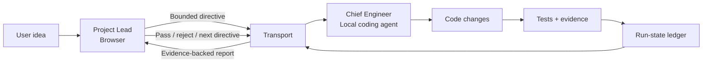

# dual-agent-loop

> A reviewable engineering loop for a browser-based Project Lead and a local coding agent.

[](./LICENSE)
[](./SKILL.md)
[](https://github.com/xulu1998/dual-agent-loop/actions/workflows/tests.yml)

`dual-agent-loop` is an open-source workflow and small toolset for developers who use one AI surface for **planning/review** and another local coding agent for **implementation**.

- **Project Lead** — browser-based ChatGPT / Claude session; owns requirements, architecture, bounded directives, review, and acceptance decisions.
- **Chief Engineer** — local agent such as Codex, Claude Code, Antigravity, or another CLI coding agent; owns repository changes, tests, evidence, and implementation.

The project tries to remove the human from being a repetitive message relay while keeping a deliberate separation between **the agent that changes the code** and **the agent that decides whether the change is acceptable**.

The core loop is:

```text
plan → implement → prove → review → continue
```

[Quick start](#quick-start) · [What is implemented](#what-is-implemented-today) · [Strict regression gate](#strict-regression-attribution-gate) · [Durable run state](#durable-run-state) · [Security](#security) · [中文](#简体中文介绍)

---

## Why this exists

A common two-tool workflow looks like this:

```text
ChatGPT / Claude: architecture + review
        ↓ copy/paste
Codex / Claude Code: implementation + tests
        ↓ copy/paste
ChatGPT / Claude: review + next instruction
```

That works, but the developer becomes the message bus. It also encourages a coding agent to combine planning, implementation, and self-approval in one context.

`dual-agent-loop` makes those responsibilities explicit:

| Project Lead | Chief Engineer |
| --- | --- |
| Refines ambiguous requirements | Inspects local repository/toolchain |
| Defines bounded directives and non-goals | Implements the smallest compliant change |
| Defines acceptance criteria | Runs project-appropriate checks |
| Reviews diffs, logs, test evidence, screenshots | Produces evidence artifacts |
| Freezes accepted contracts/surfaces | Preserves frozen surfaces unless reopened |
| Passes, rejects, or blocks a batch | Does not self-approve product quality |

This is an **opinionated engineering workflow**, not a claim that two agents are a new idea.

---

## What is implemented today

The repository currently contains working utilities for four concrete parts of the workflow:

### 1. Experimental browser ↔ terminal transport

`scripts/chatgpt_cdp_bridge.py` connects to a specifically targeted browser tab over Chrome DevTools Protocol (CDP), sends one message, and waits for a **new** assistant response.

The bridge now:

- matches an exact approved hostname (or its subdomains), not a raw URL substring;
- refuses to fall back to unrelated browser pages;
- records a pre-send assistant snapshot so an old response is not returned as a new directive;
- retries the CDP WebSocket connection;
- allows an assistant-message selector override when a browser UI changes.

CDP/DOM automation is intentionally labeled **experimental**. Browser applications can change selectors without notice, and third-party services may impose their own automation/integration rules. Check the applicable service terms/policies and prefer an approved API/MCP/integration when your environment requires one.

### 2. Strict baseline-vs-HEAD regression attribution

`scripts/compare_attribution.py` compares NUnit/JUnit-family XML inventories between a designated baseline and HEAD.

The strict gate blocks:

- **new failures**;
- **changed failure signatures** for pre-existing failing tests;
- **missing baseline tests** (a deleted test is not treated as a fix);
- **newly skipped/ignored tests**;
- **duplicate test identifiers** that make attribution ambiguous;
- **unknown test states**.

It also records SHA-256 hashes of the input reports and can include Git SHAs / runner metadata in machine-readable JSON evidence.

### 3. Durable run-state ledger

`scripts/run_state.py` persists the minimum state needed to make handoffs traceable across terminal/browser restarts:

```text
run_id
project
phase
batch_id
status
base_sha
head_sha
directive
evidence
verdict
history
```

Writes are atomic. This is a **state ledger**, not yet a full orchestration runtime.

### 4. Evidence helpers and workflow specification

- `scripts/capture_screen.py` inspects existing screenshot dimensions and formats evidence references.
- `SKILL.md` defines the dual-agent operating contract.
- `references/` contains lifecycle, initialization, reporting, and CLI guidance.

---

## How it works



The lifecycle is organized into five phases:

1. **Charter & Architecture** — scope, constraints, contracts, acceptance criteria.
2. **Walking Skeleton** — smallest runnable system and first automated baseline.
3. **Domain Logic** — bounded business rules behind testable interfaces.
4. **Presentation & Integration** — API/UI/CLI integration and runtime evidence.
5. **Hardening & Release** — project-specific stress, simulation, packaging, and release checks.

These phases are guidelines. A web service, CLI, mobile app, and game should not be forced through identical tools or evidence.

---

## Strict regression attribution gate

A legacy repository can already contain known failures. Simply requiring `all tests == green` can make incremental attribution impossible, but ignoring all failures is equally unsafe.

The gate instead compares the **test inventory and state** at baseline and HEAD.

A pre-existing failure may remain non-blocking only when:

- the test still exists;
- it is still failing for the same captured reason/signature;
- no new failure/skip/inventory blocker is introduced.

Strict blockers are conceptually:

```text
new_failures == 0
changed_failure_signatures == 0
missing_baseline_tests == 0
new_skips == 0
duplicate_test_ids == 0
unknown_test_states == 0
```

Run the included reproducible fixture:

```bash
python scripts/compare_attribution.py \
  --baseline examples/regression_gate_demo/baseline.xml \
  --head examples/regression_gate_demo/head-good.xml \
  --suite "demo" \
  --json /tmp/dual-agent-loop-good.json
```

The passing fixture contains one intentional legacy failure plus one new passing test.

Then try the failing fixture:

```bash
python scripts/compare_attribution.py \
  --baseline examples/regression_gate_demo/baseline.xml \
  --head examples/regression_gate_demo/head-bad.xml \
  --suite "demo"
```

It intentionally introduces a new failure, changes a legacy failure signature, removes a baseline test, and adds a skipped test. The command exits non-zero.

See [`examples/regression_gate_demo/README.md`](./examples/regression_gate_demo/README.md).

> This gate provides **regression attribution evidence**. It does not mathematically prove complete software correctness.

---

## Durable run state

Initialize a run ledger inside a target project:

```bash
python .agents/skills/dual-agent-loop/scripts/run_state.py \
  --state .dual-agent-loop/run-state.json \
  init --phase phase-0 --project my-project --base-sha "$(git rev-parse HEAD)"
```

Record a bounded directive:

```bash
python .agents/skills/dual-agent-loop/scripts/run_state.py \
  directive --id D-001 --base-sha "$(git rev-parse HEAD)" \
  --text "Implement the accepted bounded change"
```

Attach evidence and record the Lead verdict:

```bash
python .agents/skills/dual-agent-loop/scripts/run_state.py \
  evidence --kind regression --path artifacts/attribution.json

python .agents/skills/dual-agent-loop/scripts/run_state.py \
  verdict pass --note "Accepted by Project Lead"
```

The ledger is intentionally simple JSON so either agent can inspect it and recover the current phase/batch after interruption.

---

## Quick start

### Prerequisites

- Python 3.10+
- Google Chrome / Chromium with CDP support (only if using the experimental CDP transport)
- a browser Project Lead session
- a local coding agent capable of editing files and running shell commands

### 1. Install

From your target project directory:

```bash
git clone https://github.com/xulu1998/dual-agent-loop.git .agents/skills/dual-agent-loop
python -m pip install -r .agents/skills/dual-agent-loop/requirements.txt
```

### 2. Run the repository self-tests

```bash
python -m unittest discover \
  -s .agents/skills/dual-agent-loop/tests \
  -p "test_*.py" -v
```

### 3. Launch an isolated Chrome profile (experimental CDP transport)

**macOS**

```bash
/Applications/Google\ Chrome.app/Contents/MacOS/Google\ Chrome \
  --remote-debugging-port=9222 \
  --user-data-dir="$HOME/.dual-agent-loop/chrome-profile"
```

**Linux**

```bash
google-chrome \
  --remote-debugging-port=9222 \
  --user-data-dir=/tmp/dual-agent-loop-chrome
```

**Windows PowerShell**

```powershell
& "$env:ProgramFiles\Google\Chrome\Application\chrome.exe" `
  --remote-debugging-port=9222 `
  "--user-data-dir=$env:TEMP\dual-agent-loop-chrome"
```

Open only the intended Project Lead service in this isolated browser profile.

### 4. Smoke-test the transport

For ChatGPT:

```bash
python .agents/skills/dual-agent-loop/scripts/chatgpt_cdp_bridge.py \
  --host chatgpt.com \
  --message "Reply with exactly: DUAL_AGENT_LOOP_OK"
```

For Claude:

```bash
python .agents/skills/dual-agent-loop/scripts/chatgpt_cdp_bridge.py \
  --host claude.ai \
  --message "Reply with exactly: DUAL_AGENT_LOOP_OK"
```

Claude/browser selectors may require `--assistant-selector` if the UI has changed.

### 5. Start the workflow

Give the local Engineer agent a prompt such as:

```text
Read .agents/skills/dual-agent-loop/SKILL.md and act as the Chief Engineer.
Initialize/continue the durable run-state ledger.
Use the configured Project Lead transport to exchange bounded directives and evidence.

Project idea:
[describe the product]

Start at Phase 0. Do not self-approve product quality. After each batch, run
project-appropriate checks, generate regression/evidence artifacts, persist the
batch state, and ask the Project Lead for a verdict before continuing.
```

For more detail see [`references/CODEX_GUIDE.md`](./references/CODEX_GUIDE.md).

---

## What this is not

Today, `dual-agent-loop` is **not**:

- a novel multi-agent algorithm;
- a hosted autonomous coding platform;
- a vendor-independent message broker;
- a full persistent orchestrator that automatically launches and supervises arbitrary coding agents;
- a proof that every accepted change is bug-free.

Its current value is the combination of **independent planning/review**, **bounded implementation**, **durable handoff state**, and **strict regression/evidence gates**.

---

## Repository layout

```text
dual-agent-loop/
├── .github/workflows/tests.yml       # Repository self-tests
├── README.md
├── SECURITY.md
├── SKILL.md
├── requirements.txt
├── scripts/
│   ├── chatgpt_cdp_bridge.py         # Experimental browser transport
│   ├── compare_attribution.py        # Strict regression attribution gate
│   ├── run_state.py                  # Durable run/batch state ledger
│   └── capture_screen.py             # Screenshot evidence inspector
├── tests/
│   ├── test_cdp_bridge.py
│   ├── test_compare_attribution.py
│   └── test_run_state.py
├── examples/
│   ├── regression_gate_demo/
│   └── sample_report.md
└── references/
    ├── LIFECYCLE_STAGES.md
    ├── PROJECT_INITIALIZER.md
    ├── WORKFLOW_SPEC.md
    ├── REPORT_TEMPLATES.md
    ├── CODEX_GUIDE.md
    └── COST_AND_MODEL_TIERS.md
```

---

## Security

CDP is powerful. A process attached to an authenticated browser can interact with information visible to that profile.

- Use a **dedicated Chrome user-data directory**.
- Never fall back to or automate an unrelated browser tab.
- Keep CDP bound to the local machine; do not expose port `9222` to untrusted networks.
- Only run trusted local agents/scripts.
- Treat browser cookies, chats, and page content as sensitive.
- Check the terms/policies of any third-party web service before automating its UI.

See [`SECURITY.md`](./SECURITY.md).

---

## Current status / next engineering work

This is an **early-stage engineering workflow/toolset**.

Current priorities:

- [x] Strict baseline/HEAD inventory attribution
- [x] Repository self-tests + CI
- [x] Durable run-state ledger
- [x] Safer target selection and new-response detection for CDP transport
- [ ] Separate browser-service adapters more fully and add browser integration tests
- [ ] Add approved API/MCP-style transport adapters where practical
- [ ] Add crash/retry semantics around multi-batch orchestration
- [ ] Add more reproducible end-to-end project fixtures

Issues and pull requests are welcome, especially reproducible parser formats, browser-selector breakage, and state-machine edge cases.

---

## 简体中文介绍

`dual-agent-loop` 是一个双 Agent 软件研发工作流和小型工具集。它把两个职责明确拆开：

- **Project Lead**：负责需求、架构、批次边界、验收标准与最终裁决；
- **Chief Engineer**：负责本地仓库修改、测试、证据生成与汇报。

它并不把“双 Agent”本身当作创新点。当前重点是把协作做得**可追踪、可恢复、可审查**：

```text
规划 → 有边界的实现 → 客观证据 → 独立验收 → 下一批
```

当前已经实现：

1. **严格回归归因门禁**：除了新增失败，还会阻止失败原因变化、基线测试消失、新增 skip、重复测试 ID 与未知状态；
2. **持久化 run state**：保存 run / phase / batch / directive / SHA / evidence / verdict / history；
3. **更安全的 CDP bridge**：只匹配明确目标域名，找不到就失败，不会随机操作其它浏览器页面，并且只返回发送之后出现的新回复；
4. **仓库自身测试与 CI**：核心门禁、CDP 目标选择与 run-state 都有自动化测试；
5. **可复现 regression demo**：可以直接运行 good/bad fixture 看门禁行为。

CDP 浏览器自动化目前仍属于 **experimental transport**，不是长期稳定 API。真实项目应根据自身环境选择合适且被允许的 transport / API / MCP 集成方式。

---

## License

MIT License. See [LICENSE](./LICENSE).
